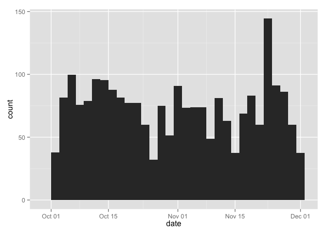

# Reproducible Research: Peer Assessment 1


This is a simple walkthrough in RMarkdown for the Data Science certification offered by John's Hopkins University through Coursera.


## Loading and preprocessing the data


A zip file was prodived in the template GIT commit for this course called activity.zip. This must be unzipped and loaded into a data frame in order to be used. I added the extra step of casting the date column as a Date type object. 


```r
library(dplyr)
```

```
## 
## Attaching package: 'dplyr'
```

```
## The following objects are masked from 'package:stats':
## 
##     filter, lag
```

```
## The following objects are masked from 'package:base':
## 
##     intersect, setdiff, setequal, union
```

```r
library(ggplot2)
unzip ("activity.zip", exdir = "./")

activity <- read.csv('activity.csv')
activity$date <- as.Date(activity$date, format="%Y-%m-%d")
head(activity)
```

```
##   steps       date interval
## 1    NA 2012-10-01        0
## 2    NA 2012-10-01        5
## 3    NA 2012-10-01       10
## 4    NA 2012-10-01       15
## 5    NA 2012-10-01       20
## 6    NA 2012-10-01       25
```

## What is mean total number of steps taken per day?


Good question, no one. THese can be answered with a series of steps. 


```r
dailySteps <- activity %>% 
  group_by(date) %>% 
  summarise(steps = sum(steps, na.rm = TRUE))

qplot(date, data=dailySteps, weight=steps, geom="histogram")
```

```
## stat_bin: binwidth defaulted to range/30. Use 'binwidth = x' to adjust this.
```


You'll notice a binwidth warning. I think it adds a nice touch.


```r
meanSteps <- 
  activity %>% 
  group_by(date) %>% 
  summarise(mean = mean(steps, na.rm = TRUE))

qplot(date, data=meanSteps, weight=mean, geom="histogram")
```

```
## stat_bin: binwidth defaulted to range/30. Use 'binwidth = x' to adjust this.
```


```r
medianSteps <- 
  activity %>% 
  filter(steps > 0) %>% 
  group_by(date) %>% 
  summarise(median = median(steps, na.rm = TRUE))

qplot(date, data=medianSteps, weight=median, geom="histogram")
```

```
## stat_bin: binwidth defaulted to range/30. Use 'binwidth = x' to adjust this.
```


## What is the average daily activity pattern?


1. Make a time series plot (i.e. 𝚝𝚢𝚙𝚎 = "𝚕") of the 5-minute interval (x-axis) and the average number of steps taken, averaged across all days (y-axis)Make a time series plot (i.e. 𝚝𝚢𝚙𝚎 = "𝚕") of the 5-minute interval (x-axis) and the average number of steps taken, averaged across all days (y-axis).

> OK


```r
meanStepsByInterval <- 
  activity %>% 
  group_by(interval) %>% 
  summarise(mean = mean(steps, na.rm = TRUE))

ggplot(meanStepsByInterval, aes(interval, mean)) + 
  geom_line()
```


2. Which 5-minute interval, on average across all the days in the dataset, contains the maximum number of steps?


```
## Source: local data frame [1 x 2]
## 
##   interval     mean
##      (int)    (dbl)
## 1      835 206.1698
```


## Imputing missing values


That's a fancy word!

There are a number of days/intervals where there are missing values (coded as 𝙽𝙰). The presence of missing days may introduce bias into some calculations or summaries of the data.

Total NA values are:

```r
sum(is.na(activity$steps))
```

```
## [1] 2304
```

I replaced all missing values with an average for that interval using the following code


```r
imputedActivity <- activity %>%
  group_by(interval) %>%
  mutate(steps = replace(steps, is.na(steps), mean(steps, na.rm = TRUE)))
head(imputedActivity)
```

```
## Source: local data frame [6 x 3]
## Groups: interval [6]
## 
##       steps       date interval
##       (dbl)     (date)    (int)
## 1 1.7169811 2012-10-01        0
## 2 0.3396226 2012-10-01        5
## 3 0.1320755 2012-10-01       10
## 4 0.1509434 2012-10-01       15
## 5 0.0754717 2012-10-01       20
## 6 2.0943396 2012-10-01       25
```

This gave me the following changes to the dataset


```r
imputedDailySteps <- imputedActivity %>% 
  group_by(date) %>% 
  summarise(steps = sum(steps))

qplot(date, data=imputedDailySteps, weight=steps, geom = "histogram")
```

```
## stat_bin: binwidth defaulted to range/30. Use 'binwidth = x' to adjust this.
```


```r
imputedMeanSteps <- 
  imputedActivity %>% 
  group_by(date) %>% 
  summarise(mean = mean(steps))

qplot(date, data=imputedMeanSteps, weight=mean, geom="histogram")
```

```
## stat_bin: binwidth defaulted to range/30. Use 'binwidth = x' to adjust this.
```



```r
imputedMedianSteps <- 
  imputedActivity %>% 
  filter(steps > 0) %>% 
  group_by(date) %>% 
  summarise(median = median(steps))
 
qplot(date, data=imputedMedianSteps, weight=median, geom="histogram")
```

```
## stat_bin: binwidth defaulted to range/30. Use 'binwidth = x' to adjust this.
```


As you can see, there is an overall rising trend when add numbers to it that were not there before. Also, I've skewed the median chart, because its ugly without massaging the data into something I want to see.

## Are there differences in activity patterns between weekdays and weekends?

1. Create a new factor variable in the dataset with two levels – “weekday” and “weekend” indicating whether a given date is a weekday or weekend day.

> OK


```r
imputedActivity$weekDay <- !chron::is.weekend(imputedActivity$date)
imputedActivity$weekDay <- factor(imputedActivity$weekDay==TRUE, labels=c("Weekend", "Weekday"))

head(imputedActivity)
```

```
## Source: local data frame [6 x 4]
## Groups: interval [6]
## 
##       steps       date interval weekDay
##       (dbl)     (date)    (int)  (fctr)
## 1 1.7169811 2012-10-01        0 Weekday
## 2 0.3396226 2012-10-01        5 Weekday
## 3 0.1320755 2012-10-01       10 Weekday
## 4 0.1509434 2012-10-01       15 Weekday
## 5 0.0754717 2012-10-01       20 Weekday
## 6 2.0943396 2012-10-01       25 Weekday
```

2. Make a panel plot containing a time series plot (i.e. 𝚝𝚢𝚙𝚎 = "𝚕") of the 5-minute interval (x-axis) and the average number of steps taken, averaged across all weekday days or weekend days (y-axis). See the README file in the GitHub repository to see an example of what this plot should look like using simulated data.

> OK


```r
imputedMeanStepsByInterval <-
  imputedActivity %>%
  group_by(interval, weekDay) %>%
  summarise(mean = mean(steps))

ggplot(imputedMeanStepsByInterval, aes(interval, mean)) + 
  geom_line() + 
  facet_wrap(~ weekDay, scales = 'free_y', ncol = 1) +
  ggtitle('Steps by interval Weekend vs Weekday') + 
  theme(plot.title = element_text(lineheight=.8, face="bold"))
```


